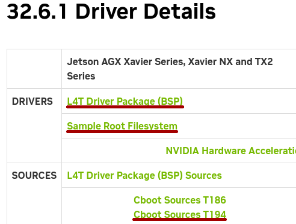

# seL4 on NVIDIA Xavier NX

## Hardware requirements

- TTL-to-RS232 USB adapter, connect it to J14 pins 3 and 4, use any of the free GND’s. This will be the Tegra common UART or TCU serial port. You will see this as /dev/ttyUSB0 on PC. The bootloader output and the seL4 test suite output will appear on this.
- Micro-A USB port connected to development PC. This is used by the NVIDIA flasher to transfer data.
- Jumper wire between pins 9 and 10 on J14. With this wire in place, the system goes to recovery mode on next power on. Always make sure you power cycle after inserting or removing the jumper, or you might get confused quickly.
- Ethernet connection to your PC, used for DHCP and TFTP.

## Linux for Tegra development kit

You will need three files from NVIDIA:

- Jetson_Linux_R32.6.1_aarch64.tbz2
- Tegra_Linux_Sample-Root-Filesystem_R32.6.1_aarch64.tbz2
- cboot_src_t19x.tbz2

You can get them from [Jetson Linux R32.6.1 Release Page](https://developer.nvidia.com/embedded/linux-tegra-r3261), look for *L4T Driver Package (BSP)*,
*Sample Root Filesystem* and *Cboot Sources T194*.

  

## Set up TFTP and DHCP

This is distribution dependent and the instructions can be easily found on the
Internet, but the generic idea is to give class C address space
192.168.5.0/255.255.255.0 to the Ethernet interface connected to Xavier NX.
192.168.5.1 will be reserved for the TFTP server on PC.

## Set up github access

Generate a SSH public/private key pair with ssh-keygen unless you have already
done so. In your github account, go to “Settings” → “SSH and GPG keys” and
upload your ```${HOME}/.ssh/id_rsa.pub``` there. Google it if this thing is alien
to you.

## Install git-repo

    # Ubuntu
    host% sudo apt-get install repo

    # Fedora
    host% mkdir -p ~/.local/bin
    host% $ curl https://storage.googleapis.com/git-repo-downloads/repo > ~/.local/bin/repo
    host% chmod u+x ~/.local/bin/repo

## Prepare sources

    # Choose a working directory
    host% export WORKDIR=~/sel4

    # Checkout Xavier NX branches
    host% mkdir ${WORKDIR} && cd ${WORKDIR}
    host% repo init -u git@github.com:tiiuae/tii_sel4_manifest.git -b tii/xaviernx -m xavier.xml
    host% repo sync

    # Extract Linux for Tegra development kit
    host% tar -C ${WORKDIR} -xjf Jetson_Linux_R32.6.1_aarch64.tbz2

    # Extract the sample rootfs there as well, important to preserve permissions!
    host% sudo tar -C ${WORKDIR}/Linux_for_Tegra/rootfs -xpjf Tegra_Linux_Sample-Root-Filesystem_R32.6.1_aarch64.tbz2

    # Extract bootloader sources
    host% mkdir ${WORKDIR}/Linux_for_Tegra/cboot
    host% tar -C ${WORKDIR}/Linux_for_Tegra/cboot -xjf cboot_src_t19x.tbz2

    # Apply seL4 related patches
    host% cd ${WORKDIR}/Linux_for_Tegra/cboot
    host% patch -p1 < ${WORKDIR}/hardware/xaviernx/patches/0001-HYPR-66-Support-seL4.patch

# Build Docker images and enter Linux for Tegra container

Install docker with:

    # Ubuntu
    sudo apt install docker.io

And add your user to the docker group:

    sudo usermod -aG docker $USER

Note: remember logout-login after add your user to the docker group

Then build the docker images and enter to L4T container:

    host% make docker
    host% make l4t

## Build modified CBOOT

l4t-container% make xaviernx_buildbl

## Change default boot to network

The next step will flash the boot configuration at ```${WORKDIR}/tii_sel4_build/hardware/xaviernx/cbo.dts```. Change the TFTP server address if needed, by default it is 192.168.5.1.

## Flash CBOOT onto Xavier NX

Connect TTL-to-USB RS232 adapter to pins XX and YY. Connect FC REC and GND pins. Connect power to Xavier NX. You should see the board with lsusb:

    l4t-container% lsusb|grep 0955
    Bus 001 Device 015: ID 0955:7e19 NVidia Corp.

Flash the bootloader:

    l4t-container% make xaviernx_flashbl

## Building the seL4 test application

    host% cd ${WORKDIR}
    host% make shell

    # configure for Xavier NX

    container% make xaviernx_defconfig

    # simple seL4 microkernel test

    container% make sel4test
    container% ls -l xaviernx_sel4test/images
    -rw-r--r--. 1 build build 16678912 Sep  1 09:03 sel4test-driver-image-arm-xaviernx

## Signing the seL4 boot image and device tree

In addition to Android boot image, CBOOT insists on downloading a DTB as well. For now it won’t be used for anything, so we will use seL4 kernel DTB, it just needs to be signed.

    l4t-container% ~/Linux_for_Tegra/l4t_sign_image.sh --chip 0x19 --split False --file xaviernx_sel4test/images/sel4test-driver-image-arm-xaviernx
    l4t-container% ~/Linux_for_Tegra/l4t_sign_image.sh --chip 0x19 --split False --file xaviernx_sel4test/kernel/kernel.dtb

Copy the signed image to your TFTP server directory and rename it to ```boot.img```. Copy the signed DTB there as well, renaming it to ```jetson.dtb```:

    host% sudo cp ${WORKDIR}/xaviernx_sel4test/images/sel4test-driver-image-arm-xaviernx_sigheader.encrypt \
      /var/lib/tftpboot/boot.img
    host% sudo cp ${WORKDIR}/xaviernx_sel4test/kernel/kernel_sigheader.dtb.encrypt \
      /var/lib/tftpboot/jetson.dtb

## Running it

Make sure the forced recovery jumper is not connected. Power cycling the Xavier NX should initiate TFTP boot. You can see seL4 output on the TCU console:

    Bootstrapping kernel
    Booting all finished, dropped to user space
    Node 0 of 1
    IOPT levels:     0
    IPC buffer:      0x806000
    Empty slots:     [1124 --> 8192)
    sharedFrames:    [0 --> 0)
    userImageFrames: [23 --> 1053)
    userImagePaging: [14 --> 19)
    untypeds:        [1053 --> 1124)
    Initial thread domain: 0
    Initial thread cnode size: 13
    List of untypeds
    ------------------
    Paddr    | Size   | Device
    0 | 25 | 1
    0x2000000 | 24 | 1
    0x3000000 | 23 | 1
    0x3800000 | 19 | 1
    0x3880000 | 12 | 1
    0x3883000 | 12 | 1
    0x3884000 | 14 | 1
    0x3888000 | 15 | 1
    0x3890000 | 16 | 1
    0x38a0000 | 17 | 1
    0x38c0000 | 18 | 1
    0x3900000 | 20 | 1
    0x3a00000 | 21 | 1
    0x3c00000 | 22 | 1
    0x4000000 | 26 | 1
    0x8000000 | 27 | 1
    0x10000000 | 28 | 1
    0x20000000 | 29 | 1
    0x40000000 | 30 | 1
    0x80000000 | 27 | 1
    0xac000000 | 21 | 1
    0xf0800000 | 23 | 1
    0xf1000000 | 24 | 1
    0xf2000000 | 25 | 1
    0xf4000000 | 26 | 1
    0xf8000000 | 27 | 1
    0x280000000 | 31 | 1
    0x300000000 | 32 | 1
    0x400000000 | 34 | 1
    0x800000000 | 35 | 1
    0x1000000000 | 36 | 1
    0x2000000000 | 37 | 1
    0x4000000000 | 38 | 1
    0x8000000000 | 39 | 1
    0x88000000 | 16 | 0
    0x88670000 | 16 | 0
    0x88680000 | 19 | 0
    0x88700000 | 20 | 0
    0x88800000 | 23 | 0
    0x89000000 | 24 | 0
    0x8a000000 | 25 | 0
    0x8c000000 | 26 | 0
    0x90000000 | 28 | 0
    0xa0000000 | 27 | 0
    0xa8000000 | 26 | 0
    0xac200000 | 21 | 0
    0xac400000 | 22 | 0
    0xac800000 | 23 | 0
    0xad000000 | 24 | 0
    0xae000000 | 25 | 0
    0xb0000000 | 28 | 0
    0xc0000000 | 29 | 0
    0xe0000000 | 28 | 0
    0xf0000000 | 23 | 0
    0x100000000 | 32 | 0
    0x200000000 | 30 | 0
    0x240000000 | 29 | 0
    0x260000000 | 28 | 0
    0x270000000 | 27 | 0
    0x278000000 | 26 | 0
    0x27c000000 | 25 | 0
    0x27e000000 | 24 | 0
    0x27f000000 | 23 | 0
    0x27f800000 | 22 | 0
    0x27fc00000 | 21 | 0
    0x27fe00000 | 20 | 0
    0x27ff00000 | 19 | 0
    0x27ffcd800 | 11 | 0
    0x27ffce000 | 13 | 0
    0x27ffd0000 | 16 | 0
    0x27ffe0000 | 17 | 0
    Untyped summary
    1 untypeds of size 11
    2 untypeds of size 12
    1 untypeds of size 13
    1 untypeds of size 14
    1 untypeds of size 15
    4 untypeds of size 16
    2 untypeds of size 17
    1 untypeds of size 18
    3 untypeds of size 19
    3 untypeds of size 20
    4 untypeds of size 21
    3 untypeds of size 22
    6 untypeds of size 23
    5 untypeds of size 24
    5 untypeds of size 25
    5 untypeds of size 26
    5 untypeds of size 27
    5 untypeds of size 28
    3 untypeds of size 29
    2 untypeds of size 30
    1 untypeds of size 31
    2 untypeds of size 32
    1 untypeds of size 34
    1 untypeds of size 35
    1 untypeds of size 36
    1 untypeds of size 37
    1 untypeds of size 38
    1 untypeds of size 39
    Switching to a safer, bigger stack...

## Troubleshooting

The TII modified CBOOT will print a note about the modifications and the kernel load address shall be 0x88000000. Fix your bootloader if your output looks different:

    [0003.959] I> ########## Net boot ##########
    [0003.959] I> EQoS: Init
    [0005.961] I> Wait till auto-calibration completes...
    [0006.197] I> Start auto-negotiation
    [0006.197] I> Wait till it completes...
    [0009.198] I> MAC addr 48:b0:2d:15:dd:c1
    [0009.198] I> DHCP: Init: Requesting IP ...
    [0009.198] I> netif status changed 0.0.0.0
    [0009.212] I> netif status changed 192.168.5.205
    [0009.699] I> Our IP: 192.168.5.205
    [0009.699] TFTP Client: Init
    [0009.699] TFTP Client: Server IP: 192.168.5.1
    [0009.700] TFTP Client: Send RRQ, file: jetson.dtb

    [0009.706] TFTP Client: Last packet received
    [0009.706] TFTP Client: Send RRQ, file: boot.img
    ################################################################################
    #############################################
    [0015.387] TFTP Client: Last packet received
    [0015.388] I> netif status changed 192.168.5.205
    [0015.389] I> Validate kernel ...
    [0015.389] I> T19x: Authenticate kernel (bin_type: 37), max size 0x5000000
    [0015.536] I> Encryption fuse is not ON
    [0015.561] I> Validate kernel-dtb ...
    [0015.561] I> T19x: Authenticate kernel-dtb (bin_type: 38), max size 0x400000
    [0015.562] I> Encryption fuse is not ON
    [0015.563] I> Checking boot.img header magic ... [0015.563] I> [OK]
    [0015.564] I> Kernel hdr @0xa42c0000
    [0015.564] I> Kernel dtb @0x90000000
    [0015.564] I> ----------------------------------------------
    [0015.568] I> --------- TII modifications in place ---------
    [0015.573] I> ----------------------------------------------
    [0015.578] I> decompressor handler not found
    [0015.582] I> Copying kernel image (16101696 bytes) from 0xa42c0800 to 0x88000000 ...
